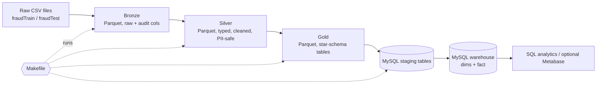
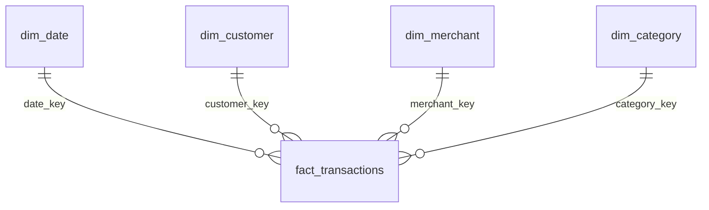

# Credit Card Transactions Data Warehouse (Sparkov)

A locally runnable data warehouse built on the **Sparkov credit card fraud dataset**, using a **medallion architecture** (Bronze → Silver → Gold), **PySpark** for transformations, **MySQL** as the warehouse, **SQL** for modeling and analytics, and **SCD Type 2** for customer history.

> This README doubles as a **step-by-step build guide**. Follow the phases in order and tick the checkboxes as you go. Everything is sized for a **MacBook Air M1 with 8 GB RAM**.
>
> **This is the simplified version.** Airflow, the large data quality rule engine, audit tables, and incremental loads are moved to [Stretch goals](#stretch-goals-after-the-core-works) so you can finish a working warehouse first and add polish afterwards.

---

## Table of Contents

1. [Project Overview](#1-project-overview)
2. [The Dataset](#2-the-dataset)
3. [Architecture](#3-architecture)
4. [Tech Stack and Versions](#4-tech-stack-and-versions)
5. [Repository Structure](#5-repository-structure)
6. [Data Model (Gold Layer)](#6-data-model-gold-layer)
7. [Step-by-Step Build Guide](#7-step-by-step-build-guide)
   - [Phase 0: Prerequisites](#phase-0--prerequisites)
   - [Phase 1: Environment setup](#phase-1--environment-setup)
   - [Phase 2: Get and explore the data](#phase-2--get-and-explore-the-data)
   - [Phase 3: MySQL setup](#phase-3--mysql-setup)
   - [Phase 4: Bronze layer](#phase-4--bronze-layer-raw-ingestion)
   - [Phase 5: Silver layer](#phase-5--silver-layer-clean-and-conform)
   - [Phase 6: Gold layer and MySQL load](#phase-6--gold-layer-and-mysql-load)
   - [Phase 7: Orchestration with Make (Airflow optional)](#phase-7--orchestration-with-make-airflow-optional)
   - [Phase 8: SCD Type 2](#phase-8--scd-type-2-simulated-customer-updates)
   - [Phase 9: Analytics and dashboard](#phase-9--analytics-and-dashboard)
   - [Phase 10: Tests and polish](#phase-10--tests-and-polish)
8. [Data Quality Rules](#8-data-quality-rules)
9. [Performance Tips for 8 GB RAM](#9-performance-tips-for-8-gb-ram)
10. [Troubleshooting](#10-troubleshooting)
11. [Interview Talking Points](#11-interview-talking-points)

---

## 1. Project Overview

**Business context:** A card-issuing bank wants a central warehouse to monitor card transactions and analyze fraud patterns across customers, merchants, merchant categories, locations, and time.

**Business questions the warehouse answers:**

- Which merchant categories have the highest fraud rate and the most fraud loss?
- At what hours of the day and days of the week does fraud peak?
- Which states and customer age bands are most affected?
- Is the distance between the customer's home and the merchant related to fraud?
- Which merchants and customers show unusual activity (velocity, amount spikes)?
- How do monthly transaction volume and spend trend over time?

**What this project demonstrates:**

| Skill | Where |
|---|---|
| Medallion architecture | Bronze / Silver / Gold layers |
| Distributed ETL | PySpark in local mode |
| Dimensional modeling from a flat file | One CSV split into a star schema |
| SCD Type 2 with point-in-time joins | `dim_customer` |
| Repeatable loads | Full-refresh load that gives the same result every time you run it |
| Data quality | A handful of validation rules with printed row counts |
| PII handling | Card number hashed and masked before Gold |
| Orchestration | One `make all` command (Airflow is optional) |
| Reconciliation | Row-count and control-total checks after the MySQL load |

### Stretch goals (after the core works)

These were deliberately left out of the core build. Add them one at a time, in this order:

1. **Incremental loads:** load `fraudTrain` first and `fraudTest` later instead of together.
2. **Audit and DQ tables:** `etl_run_log` and `dq_results`, plus a rejects folder with a reason per rejected row.
3. **More DQ rules** (see [Section 8](#8-data-quality-rules)).
4. **Airflow** DAG (see the optional part of [Phase 7](#phase-7--orchestration-with-make-airflow-optional)).
5. **Dashboard** with Metabase, and unit tests.
6. **Extra modeling:** `dim_time`, Unknown members (`key = -1`), an `agg_fraud_daily` table, or a `dim_geography` snowflake.

---

## 2. The Dataset

**Credit Card Transactions Fraud Detection Dataset** on Kaggle (search that title), generated with the open-source **Sparkov Data Generation** tool. The data is **synthetic**, fully in **English**, and needs **no code decoding**.

| File | Rows (approx.) | Period | Role in this project |
|---|---|---|---|
| `fraudTrain.csv` | ~1.3 million | Jan 2019 to mid-Jun 2020 | Loaded together with the test file |
| `fraudTest.csv` | ~0.55 million | mid-Jun 2020 to Dec 2020 | Loaded together with the train file. Its period contains the date (2020-07-01) used for the SCD2 demo |

Roughly 1,000 customers, ~700 merchants, 14 merchant categories, and a fraud rate **below 1%** (a heavily imbalanced dataset).

### Columns

| Column | Description | Warehouse destination |
|---|---|---|
| *(unnamed first column)* | Row index | Dropped in Silver (Spark names it `_c0`) |
| `trans_date_trans_time` | Transaction timestamp | `txn_ts`, `date_key`, `hour_of_day` |
| `cc_num` | Credit card number | **Hashed** into `customer_id`; only last 4 digits kept |
| `merchant` | Merchant name (prefixed with `fraud_`) | `dim_merchant` (prefix stripped) |
| `category` | Merchant category, e.g. `grocery_pos`, `travel` | `dim_category` |
| `amt` | Transaction amount | `amount` measure |
| `first`, `last`, `gender`, `dob` | Cardholder details | `dim_customer` |
| `street`, `city`, `state`, `zip`, `job` | Cardholder address and occupation | `dim_customer` (SCD2 tracked) |
| `lat`, `long` | Cardholder home coordinates | Silver only (used to calculate `distance_km`) |
| `city_pop` | City population | Not used in this simplified version |
| `trans_num` | Unique transaction id | Degenerate dimension in the fact |
| `unix_time` | Epoch timestamp | Not needed (redundant) |
| `merch_lat`, `merch_long` | Merchant location for this transaction | Kept on the fact, used for `distance_km` |
| `is_fraud` | 1 = fraud, 0 = legitimate | Fact flag |

### Things to know before coding

- **No customer id exists.** `cc_num` is the customer identity. Never store it raw in Gold; hash it (`sha2`) and keep the last 4 digits for display.
- **Merchant names carry a `fraud_` prefix** in the raw data. Strip it with a regex.
- **Merchant names contain commas** (e.g. `Rippin, Kub and Mann`) inside quoted fields. Spark's CSV reader handles quotes, but check your row counts.
- **`zip` can lose leading zeros** (stored as a number). Left-pad to 5 characters.
- **Merchant coordinates may vary per transaction row**, so do not put them on `dim_merchant`. Verify this in Phase 2 and keep them on the fact.
- **Customer attributes are constant** in this synthetic data, so real history does not exist. Phase 8 simulates customer address and job changes so SCD Type 2 is demonstrated honestly.
- **Class imbalance:** fraud is rare. Always report fraud as a **rate** (`fraud / total`) and a **count**, never just counts.

### Merchant categories (14)

`entertainment`, `food_dining`, `gas_transport`, `grocery_net`, `grocery_pos`, `health_fitness`, `home`, `kids_pets`, `misc_net`, `misc_pos`, `personal_care`, `shopping_net`, `shopping_pos`, `travel`

The suffix tells you the channel: `_net` = online, `_pos` = in-store point of sale. You will derive a `channel` attribute from it.

---

## 3. Architecture



**Layer responsibilities**

| Layer | Storage | Contents | Rules |
|---|---|---|---|
| **Bronze** | Parquet (`data/bronze`) | Exact copy of the source, all columns as strings, plus `_ingestion_ts`, `_source_name`, `_batch_id` | No business logic. Never alter source values. |
| **Silver** | Parquet (`data/silver`) | Typed, cleaned, validated, deduplicated transactions with readable names, hashed card id, derived distance and age band | Rows that fail a rule are dropped, and the counts are printed |
| **Gold** | Parquet (`data/gold`) then MySQL (`sparkov_dwh`) | Star schema: dimensions and one fact table | Fully refreshed on every load, so it is safe to re-run |

**How data moves into MySQL:** Spark writes the dimensions straight into MySQL, and writes the fact rows (with natural keys such as `customer_id` and `merchant_name`) into a staging table. SQL then swaps the natural keys for surrogate keys while inserting into the fact table.

---

## 4. Tech Stack and Versions

| Tool | Version | Notes |
|---|---|---|
| Python | 3.11 | One virtual environment (`.venv`) |
| Java | 17 (ARM64) | Required by Spark |
| PySpark | 3.5.x | Local mode, `local[4]` |
| MySQL | 8.x | Native via Homebrew (lighter than Docker) |
| MySQL Connector/J | 8.4.x | JDBC driver for Spark |
| Make | built in | Comes with the Xcode command line tools |
| Optional: Apache Airflow | 2.10.x | Stretch goal. Needs its **own** virtual environment |
| Optional: Metabase | latest | Dashboard (runs as a JAR) |

---

## 5. Repository Structure

```
sparkov-fraud-dwh/
├── README.md
├── requirements.txt
├── .env.example                 # DB credentials (copy to .env, never commit .env)
├── .gitignore
├── Makefile                     # shortcuts: make bronze / silver / gold / load / all
├── data/                        # gitignored
│   ├── landing/                 # fraudTrain.csv, fraudTest.csv, customer_updates.csv
│   ├── bronze/
│   ├── silver/
│   └── gold/
├── sql/
│   ├── 01_create_database.sql   # database + ETL user
│   ├── 02_ddl.sql               # dims, fact, staging tables
│   ├── 03_reset_tables.sql      # empties every table before a full refresh
│   ├── 04_scd2_updates.sql      # close old customer versions, insert new ones
│   ├── 05_load_fact.sql         # staging -> fact (key lookups, point-in-time join)
│   └── 06_analytics_queries.sql
├── src/
│   ├── common/
│   │   ├── spark_session.py
│   │   └── mysql_utils.py       # run SQL files, JDBC write helper
│   ├── bronze/ingest_bronze.py
│   ├── silver/transform_silver.py
│   └── gold/
│       ├── build_gold.py        # builds dims and fact from Silver (Parquet)
│       └── load_mysql.py        # writes to MySQL, runs SQL, reconciles
├── scripts/
│   └── simulate_customer_updates.py
├── tests/
│   └── test_transformations.py  # optional
└── docs/
    ├── architecture.png
    ├── erd.png
    └── data_notes.md
```

---

## 6. Data Model (Gold Layer)

One fact table surrounded by four dimensions (a classic star schema).



### Fact table

| Table | Grain | Measures and flags |
|---|---|---|
| `fact_transactions` | One row per card transaction | `amount`, `is_fraud`, `distance_km`, `merch_lat`, `merch_long`, `hour_of_day`, degenerate `trans_num` |

### Dimensions

| Dimension | Type | Key attributes |
|---|---|---|
| `dim_date` | Static (2019 to 2020) | date, year, quarter, month, day of week, is_weekend |
| `dim_customer` | **SCD Type 2** | customer_id (hashed), card_last4, name, gender, dob, age_band, job, street, city, state, zip, effective_from/to, is_current |
| `dim_merchant` | Type 1 | merchant_name |
| `dim_category` | Static | category_code, category_name, channel (Online / In-store / Other) |

**Design decisions to mention in your write-up**

- `customer_id` is a `sha2` hash of `cc_num`, so the warehouse never holds raw card numbers.
- `age_band` is calculated as of a fixed reference date (2020-12-31) and documented as such.
- `hour_of_day` lives on the fact table instead of a separate time dimension. It is a small number (0 to 23) and needs no extra attributes.
- **SCD2 tracks only address and job** (`street`, `city`, `state`, `zip`, `job`). Changes are detected by comparing those columns directly in SQL.
- Every fact row must find all four dimension rows. The fact load uses inner joins, and the reconciliation step fails if any row is lost.
- Merchant location stays on the fact because it appears to vary per transaction.

### DDL (`sql/02_ddl.sql`)

```sql
USE sparkov_dwh;

CREATE TABLE dim_date (
  date_key     INT PRIMARY KEY,               -- 20190105
  full_date    DATE NOT NULL,
  year         SMALLINT, quarter TINYINT, month TINYINT, month_name VARCHAR(12),
  day_of_month TINYINT, day_of_week TINYINT, day_name VARCHAR(10),
  is_weekend   BOOLEAN
);

CREATE TABLE dim_category (
  category_key  INT AUTO_INCREMENT PRIMARY KEY,
  category_code VARCHAR(30) NOT NULL UNIQUE,  -- grocery_pos
  category_name VARCHAR(40),                  -- Grocery
  channel       VARCHAR(10)                   -- Online / In-store / Other
);

CREATE TABLE dim_merchant (
  merchant_key  INT AUTO_INCREMENT PRIMARY KEY,
  merchant_name VARCHAR(100) NOT NULL UNIQUE
);

CREATE TABLE dim_customer (                    -- SCD Type 2
  customer_key    BIGINT AUTO_INCREMENT PRIMARY KEY,
  customer_id     CHAR(64) NOT NULL,           -- sha256 of cc_num (natural key)
  card_last4      CHAR(4),
  first_name      VARCHAR(50), last_name VARCHAR(50),
  gender          CHAR(1),
  dob             DATE, age_band VARCHAR(10),
  job             VARCHAR(100),                -- tracked
  street          VARCHAR(100),                -- tracked
  city            VARCHAR(60),                 -- tracked
  state           CHAR(2),                     -- tracked
  zip             CHAR(5),                     -- tracked
  effective_from  DATE NOT NULL,
  effective_to    DATE NOT NULL DEFAULT '9999-12-31',
  is_current      BOOLEAN NOT NULL DEFAULT TRUE,
  UNIQUE KEY uq_customer_version (customer_id, effective_from),
  KEY idx_customer_lookup (customer_id, effective_from, effective_to)
);

CREATE TABLE fact_transactions (
  fact_key     BIGINT AUTO_INCREMENT PRIMARY KEY,
  trans_num    VARCHAR(40) NOT NULL,            -- degenerate dimension
  date_key     INT NOT NULL,
  hour_of_day  TINYINT NOT NULL,
  customer_key BIGINT NOT NULL,
  merchant_key INT NOT NULL,
  category_key INT NOT NULL,
  amount       DECIMAL(10,2) NOT NULL,
  is_fraud     TINYINT NOT NULL,
  distance_km  DECIMAL(8,2),
  merch_lat    DECIMAL(9,6), merch_long DECIMAL(9,6),
  txn_ts       DATETIME NOT NULL,
  source_name  VARCHAR(20) NOT NULL,            -- fraudTrain / fraudTest
  UNIQUE KEY uq_trans_num (trans_num),
  CONSTRAINT fk_f_date     FOREIGN KEY (date_key)     REFERENCES dim_date(date_key),
  CONSTRAINT fk_f_customer FOREIGN KEY (customer_key) REFERENCES dim_customer(customer_key),
  CONSTRAINT fk_f_merchant FOREIGN KEY (merchant_key) REFERENCES dim_merchant(merchant_key),
  CONSTRAINT fk_f_category FOREIGN KEY (category_key) REFERENCES dim_category(category_key)
);

-- Staging tables: NATURAL keys, no foreign keys. Spark fills them, SQL reads them.
CREATE TABLE stg_fact_transactions (
  trans_num VARCHAR(40), txn_ts DATETIME, date_key INT, hour_of_day TINYINT,
  customer_id CHAR(64), merchant_name VARCHAR(100), category_code VARCHAR(30),
  amount DECIMAL(10,2), is_fraud TINYINT, distance_km DECIMAL(8,2),
  merch_lat DECIMAL(9,6), merch_long DECIMAL(9,6), source_name VARCHAR(20)
);

CREATE TABLE stg_customer_updates (
  customer_id CHAR(64), street VARCHAR(100), city VARCHAR(60), state CHAR(2),
  zip CHAR(5), job VARCHAR(100), effective_from DATE
);
```

---

## 7. Step-by-Step Build Guide

> **Tip: work on a sample first.** Every command below works with `SAMPLE=0.1` (10% of the rows, spread across the whole date range). Runs take seconds instead of minutes, and the SCD2 demo still works. Switch to the full data once everything runs end to end.

### Phase 0 — Prerequisites

- [ ] macOS with [Homebrew](https://brew.sh) installed
- [ ] Xcode command line tools (`xcode-select --install`), which give you `make`
- [ ] ~5 GB free disk space
- [ ] Git installed and a GitHub account (this is a portfolio project)
- [ ] A free Kaggle account (to download the dataset)

---

### Phase 1 — Environment setup

**1.1 Install Java 17, Python 3.11, and MySQL**

```bash
brew install openjdk@17 python@3.11 mysql

# make Java 17 visible to macOS
sudo ln -sfn /opt/homebrew/opt/openjdk@17/libexec/openjdk.jdk \
  /Library/Java/JavaVirtualMachines/openjdk-17.jdk

echo 'export JAVA_HOME=$(/usr/libexec/java_home -v 17)' >> ~/.zshrc
source ~/.zshrc
java -version    # should print 17.x (aarch64)
```

**1.2 Create the project and the virtual environment**

```bash
mkdir sparkov-fraud-dwh && cd sparkov-fraud-dwh
git init
mkdir -p data/{landing,bronze,silver,gold} sql \
         src/{common,bronze,silver,gold} scripts tests docs

python3.11 -m venv .venv
source .venv/bin/activate
```

`requirements.txt`:

```
pyspark==3.5.3
python-dotenv
mysql-connector-python
pytest
```

```bash
pip install -r requirements.txt
python -c "import pyspark; print(pyspark.__version__)"
```

**1.3 Create `.gitignore`**

```
.venv/
data/
.env
__pycache__/
```

**1.4 Create the shared Spark session** (`src/common/spark_session.py`)

```python
from pyspark.sql import SparkSession

def get_spark(app_name: str) -> SparkSession:
    return (
        SparkSession.builder
        .master("local[4]")
        .appName(app_name)
        .config("spark.driver.memory", "3g")
        .config("spark.sql.shuffle.partitions", "8")
        .config("spark.sql.session.timeZone", "UTC")
        .config("spark.driver.extraJavaOptions", "-Duser.timezone=UTC")
        .config("spark.jars.packages", "com.mysql:mysql-connector-j:8.4.0")
        .getOrCreate()
    )
```

- [ ] Java 17 works
- [ ] Virtual environment created and PySpark imports
- [ ] Repo initialized with `.gitignore`

---

### Phase 2 — Get and explore the data

**2.1 Download the dataset**

Manual: download from Kaggle and unzip `fraudTrain.csv` and `fraudTest.csv` into `data/landing/`.

Or with the Kaggle CLI (needs an API token in `~/.kaggle/kaggle.json`; check the dataset slug on its Kaggle page):

```bash
pip install kaggle
kaggle datasets download -d kartik2112/fraud-detection -p data/landing --unzip
```

**2.2 Explore before you design.** Run this in a PySpark shell or notebook (from the project root, with `export PYTHONPATH=$(pwd)`):

```python
from pyspark.sql import functions as F
from src.common.spark_session import get_spark
spark = get_spark("explore")

train = spark.read.csv("data/landing/fraudTrain.csv", header=True)
train.printSchema()                                   # note the _c0 column
train.count()

train.groupBy("category").count().show()
train.groupBy("is_fraud").count().show()              # confirm class imbalance

# Does the merchant location vary per merchant?
train.groupBy("merchant").agg(F.countDistinct("merch_lat").alias("locs")).show(5)

# Does each card have exactly one address and job?
(train.groupBy("cc_num")
      .agg(F.countDistinct("street").alias("streets"),
           F.countDistinct("job").alias("jobs"))
      .filter("streets > 1 OR jobs > 1").count())

# Leading zeros lost in zip codes?
train.filter(F.length("zip") < 5).select("zip", "state").show(5)

# Overlap in trans_num between train and test?
test = spark.read.csv("data/landing/fraudTest.csv", header=True)
train.select("trans_num").intersect(test.select("trans_num")).count()
```

- [ ] Both files are in `data/landing/`
- [ ] Findings written down in `docs/data_notes.md` (great material for your final write-up)

---

### Phase 3 — MySQL setup

**3.1 Start MySQL and secure it**

```bash
brew services start mysql
mysql_secure_installation
```

**3.2 Create the database and a dedicated ETL user** (`sql/01_create_database.sql`)

```sql
CREATE DATABASE IF NOT EXISTS sparkov_dwh CHARACTER SET utf8mb4;
CREATE USER IF NOT EXISTS 'etl_user'@'localhost' IDENTIFIED BY 'change_me';
GRANT ALL PRIVILEGES ON sparkov_dwh.* TO 'etl_user'@'localhost';
FLUSH PRIVILEGES;
```

```bash
mysql -u root -p < sql/01_create_database.sql
```

**3.3 Create `.env`** (copy from `.env.example`)

```
MYSQL_HOST=localhost
MYSQL_PORT=3306
MYSQL_DB=sparkov_dwh
MYSQL_USER=etl_user
MYSQL_PASSWORD=change_me
```

**3.4 Run the DDL** (the full DDL is in [Section 6](#ddl-sql02_ddlsql))

```bash
mysql -u etl_user -p sparkov_dwh < sql/02_ddl.sql
mysql -u etl_user -p sparkov_dwh -e "SHOW TABLES;"
```

**3.5 Create the reset script** (`sql/03_reset_tables.sql`). The load step runs it first, so every load starts from empty tables and gives the same result every time.

```sql
SET FOREIGN_KEY_CHECKS = 0;
TRUNCATE TABLE fact_transactions;
TRUNCATE TABLE dim_customer;
TRUNCATE TABLE dim_merchant;
TRUNCATE TABLE dim_category;
TRUNCATE TABLE dim_date;
TRUNCATE TABLE stg_fact_transactions;
TRUNCATE TABLE stg_customer_updates;
SET FOREIGN_KEY_CHECKS = 1;
```

**3.6 Create the MySQL helper** (`src/common/mysql_utils.py`)

```python
import os
from pathlib import Path
import mysql.connector
from dotenv import load_dotenv

load_dotenv()
CFG = dict(host=os.getenv("MYSQL_HOST", "localhost"),
           port=int(os.getenv("MYSQL_PORT", "3306")),
           database=os.getenv("MYSQL_DB"),
           user=os.getenv("MYSQL_USER"),
           password=os.getenv("MYSQL_PASSWORD"))

JDBC_URL = (f"jdbc:mysql://{CFG['host']}:{CFG['port']}/{CFG['database']}"
            "?rewriteBatchedStatements=true"
            "&connectionTimeZone=UTC&forceConnectionTimeZoneToSession=true")

def run_sql_file(path: str) -> None:
    """Run every statement in a .sql file. Comments (--) are stripped and the file is
    split on ';', so do not put either inside a string value."""
    text = "\n".join(line.split("--")[0] for line in Path(path).read_text().splitlines())
    conn = mysql.connector.connect(**CFG)
    cur = conn.cursor()
    for stmt in text.split(";"):
        if stmt.strip():
            cur.execute(stmt)
    conn.commit()
    cur.close(); conn.close()

def fetch_one(sql: str):
    conn = mysql.connector.connect(**CFG)
    cur = conn.cursor()
    cur.execute(sql)
    row = cur.fetchone()
    cur.close(); conn.close()
    return row

def write_table(df, table: str) -> None:
    """Append a Spark DataFrame to an (already empty) MySQL table."""
    (df.write.format("jdbc")
       .option("url", JDBC_URL)
       .option("dbtable", table)
       .option("user", CFG["user"]).option("password", CFG["password"])
       .option("driver", "com.mysql.cj.jdbc.Driver")
       .option("batchsize", 10000)
       .option("numPartitions", 4)
       .mode("append").save())
```

> `rewriteBatchedStatements=true` is the single biggest speedup for JDBC inserts into MySQL. Without it, a million rows can take a very long time. The two time-zone options stop dates from shifting by a few hours, which matters for SCD2.

- [ ] MySQL running, database and user created
- [ ] All dimension, fact, and staging tables exist
- [ ] `mysql_utils.py` can connect (try `fetch_one("SELECT 1")`)

---

### Phase 4 — Bronze layer (raw ingestion)

**Goal:** land the raw files in Parquet, unchanged, with audit metadata.

**Rules**
- Read everything as **strings** (`inferSchema=False`) so nothing is silently altered.
- Add `_ingestion_ts`, `_source_name`, `_batch_id`.
- Partition by `_source_name`. Both files are ingested in one run, and the whole Bronze folder is rewritten each time.
- Development shortcut: `--sample 0.1` keeps a random 10% of each file. Leave it at `1.0` for the real run.

`src/bronze/ingest_bronze.py` (core logic):

```python
import argparse
from datetime import datetime
from functools import reduce
from pyspark.sql import functions as F
from src.common.spark_session import get_spark

SOURCES = {
    "fraudTrain": "data/landing/fraudTrain.csv",
    "fraudTest":  "data/landing/fraudTest.csv",
}

def main(sample: float):
    spark = get_spark("bronze_ingest")
    batch_id = datetime.now().strftime("%Y%m%dT%H%M%S")

    frames = []
    for name, path in SOURCES.items():
        df = spark.read.csv(path, header=True, inferSchema=False, quote='"', escape='"')
        if sample < 1.0:
            df = df.sample(fraction=sample, seed=42)
        frames.append(df.withColumn("_ingestion_ts", F.current_timestamp())
                        .withColumn("_source_name", F.lit(name))
                        .withColumn("_batch_id", F.lit(batch_id)))

    bronze = reduce(lambda a, b: a.unionByName(b), frames)
    bronze.write.mode("overwrite").partitionBy("_source_name").parquet("data/bronze/transactions")

    spark.read.parquet("data/bronze/transactions").groupBy("_source_name").count().show()

if __name__ == "__main__":
    p = argparse.ArgumentParser()
    p.add_argument("--sample", type=float, default=1.0)
    main(p.parse_args().sample)
```

Run it from the project root:

```bash
source .venv/bin/activate
export PYTHONPATH=$(pwd)
python src/bronze/ingest_bronze.py --sample 0.1
ls data/bronze/transactions
```

- [ ] `data/bronze/transactions/_source_name=fraudTrain` and `..=fraudTest` exist
- [ ] The row counts printed match the CSV row counts (when `--sample 1.0`)

---

### Phase 5 — Silver layer (clean and conform)

**Goal:** typed, validated, deduplicated, PII-safe transactions with readable column names.

**Transformations**

| Step | Detail |
|---|---|
| Rename | `_c0` (drop), `first` → `first_name`, `last` → `last_name`, `amt` → `amount`, `lat`/`long` → `cust_lat`/`cust_long` |
| Types | Timestamp, date (`dob`), `decimal(10,2)` amount, ints, doubles for coordinates |
| Text cleanup | Trim strings, `initcap` names and city, `upper` state, strip `fraud_` from merchant, left-pad `zip` to 5 |
| PII | `customer_id = sha2(cc_num, 256)`, `card_last4`, then **drop `cc_num`** |
| Derived | `date_key`, `hour_of_day`, `distance_km` (haversine), `age_band` |
| Validation | The 5 rules in [Section 8](#8-data-quality-rules); failures are counted, then dropped |
| Dedupe | One row per `trans_num` |

**Core snippet** (`src/silver/transform_silver.py`)

```python
from pyspark.sql import functions as F
from src.common.spark_session import get_spark

spark = get_spark("silver_transform")
raw = spark.read.parquet("data/bronze/transactions")

def haversine_km(lat1, lon1, lat2, lon2):
    r = 6371.0
    dlat, dlon = F.radians(lat2 - lat1), F.radians(lon2 - lon1)
    a = (F.sin(dlat / 2) ** 2
         + F.cos(F.radians(lat1)) * F.cos(F.radians(lat2)) * F.sin(dlon / 2) ** 2)
    return F.round(2 * r * F.asin(F.sqrt(a)), 2)

typed = (raw
    .withColumn("txn_ts", F.to_timestamp("trans_date_trans_time", "yyyy-MM-dd HH:mm:ss"))
    .withColumn("dob", F.to_date("dob", "yyyy-MM-dd"))
    .withColumn("amount", F.col("amt").cast("decimal(10,2)"))
    .withColumn("is_fraud", F.col("is_fraud").cast("int"))
    .withColumn("merchant_name", F.trim(F.regexp_replace("merchant", "^fraud_", "")))
    .withColumn("category_code", F.lower(F.trim("category")))
    .withColumn("first_name", F.initcap(F.trim("first")))
    .withColumn("last_name", F.initcap(F.trim("last")))
    .withColumn("street", F.trim("street"))
    .withColumn("city", F.initcap(F.trim("city")))
    .withColumn("job", F.trim("job"))
    .withColumn("gender", F.upper(F.trim("gender")))
    .withColumn("state", F.upper(F.trim("state")))
    .withColumn("zip", F.lpad(F.trim("zip"), 5, "0"))
    .withColumn("cust_lat", F.col("lat").cast("double"))
    .withColumn("cust_long", F.col("long").cast("double"))
    .withColumn("merch_lat", F.col("merch_lat").cast("double"))
    .withColumn("merch_long", F.col("merch_long").cast("double"))
    .withColumn("customer_id", F.sha2(F.col("cc_num").cast("string"), 256))
    .withColumn("card_last4", F.substring(F.col("cc_num").cast("string"), -4, 4))
    .withColumn("date_key", F.date_format("txn_ts", "yyyyMMdd").cast("int"))
    .withColumn("hour_of_day", F.hour("txn_ts"))
    .withColumn("distance_km",
                haversine_km("cust_lat", "cust_long", "merch_lat", "merch_long"))
    .drop("cc_num", "_c0", "unix_time", "merchant", "category", "amt", "first", "last",
          "lat", "long", "city_pop", "trans_date_trans_time"))

# age_band, calculated as of a fixed reference date
age = F.floor(F.months_between(F.lit("2020-12-31").cast("date"), F.col("dob")) / 12)
typed = typed.withColumn("age_band",
    F.when(age < 25, "<25").when(age < 35, "25-34").when(age < 45, "35-44")
     .when(age < 55, "45-54").when(age < 65, "55-64").otherwise("65+"))
```

**Validation: count what fails, then drop it**

```python
rules = {   # each rule is True when the row is BAD
    "null_trans_num": F.col("trans_num").isNull(),
    "bad_timestamp":  F.col("txn_ts").isNull() | (F.col("txn_ts") < "2019-01-01")
                      | (F.col("txn_ts") >= "2021-01-01"),
    "bad_amount":     F.col("amount").isNull() | (F.col("amount") <= 0),
    "null_card":      F.col("customer_id").isNull(),
}

n_read = typed.count()
typed.agg(*[F.sum(cond.cast("int")).alias(name) for name, cond in rules.items()]).show()

any_bad = F.lit(False)
for cond in rules.values():
    any_bad = any_bad | cond

valid = (typed.filter(~any_bad)
              .dropDuplicates(["trans_num"]))       # rule 5: one row per trans_num

valid.write.mode("overwrite").partitionBy("_source_name").parquet("data/silver/transactions")

n_written = spark.read.parquet("data/silver/transactions").count()
print(f"[silver] read={n_read}  written={n_written}  dropped={n_read - n_written}")
```

- [ ] Silver Parquet written
- [ ] The per-rule failure counts and the `read / written / dropped` line are printed
- [ ] No `cc_num` column in Silver
- [ ] Spot checks: gender is only M or F, `zip` always 5 characters, fraud rate is sane (under 2%)

---

### Phase 6 — Gold layer and MySQL load

**Goal:** build the star-schema tables from Silver, then load MySQL with **surrogate keys resolved in SQL**.

**6.1 Build the gold datasets** (`src/gold/build_gold.py`)

| Output (`data/gold/...`) | How to build |
|---|---|
| `dim_date` | Generate every date 2019-01-01 to 2020-12-31 (`sequence` + `explode`) |
| `dim_category` | Distinct `category_code`, plus a readable name and `channel` (`_net` = Online, `_pos` = In-store, else Other) |
| `dim_merchant` | Distinct `merchant_name` |
| `dim_customer` | One row per `customer_id`, latest attributes via `F.max_by(col, "txn_ts")`, plus the SCD2 columns `effective_from = 1900-01-01`, `effective_to = 9999-12-31`, `is_current = true` |
| `fact_transactions` | Silver columns with **natural keys**: `customer_id`, `merchant_name`, `category_code`, `date_key`, `hour_of_day` |

```python
from pyspark.sql import functions as F
from src.common.spark_session import get_spark

spark = get_spark("gold_build")
silver = spark.read.parquet("data/silver/transactions")

def save(df, name):
    df.write.mode("overwrite").parquet(f"data/gold/{name}")

# dim_date: one row per day
dim_date = (spark.sql("SELECT explode(sequence(to_date('2019-01-01'), to_date('2020-12-31'), interval 1 day)) AS full_date")
    .select(F.date_format("full_date", "yyyyMMdd").cast("int").alias("date_key"),
            "full_date",
            F.year("full_date").alias("year"),
            F.quarter("full_date").alias("quarter"),
            F.month("full_date").alias("month"),
            F.date_format("full_date", "MMMM").alias("month_name"),
            F.dayofmonth("full_date").alias("day_of_month"),
            F.dayofweek("full_date").alias("day_of_week"),        # 1 = Sunday
            F.date_format("full_date", "EEEE").alias("day_name"),
            F.dayofweek("full_date").isin(1, 7).alias("is_weekend")))

# dim_category
dim_category = (silver.select("category_code").distinct()
    .withColumn("category_name",
        F.initcap(F.regexp_replace(F.regexp_replace("category_code", "_(net|pos)$", ""), "_", " ")))
    .withColumn("channel",
        F.when(F.col("category_code").endswith("_net"), "Online")
         .when(F.col("category_code").endswith("_pos"), "In-store")
         .otherwise("Other")))

# dim_merchant
dim_merchant = silver.select("merchant_name").distinct()

# dim_customer: first version of every customer, valid from 1900-01-01
attrs = ["card_last4", "first_name", "last_name", "gender", "dob", "age_band",
         "job", "street", "city", "state", "zip"]
dim_customer = (silver.groupBy("customer_id")
    .agg(*[F.max_by(c, "txn_ts").alias(c) for c in attrs])
    .withColumn("effective_from", F.lit("1900-01-01").cast("date"))
    .withColumn("effective_to",   F.lit("9999-12-31").cast("date"))
    .withColumn("is_current",     F.lit(True)))

# fact (natural keys only; surrogate keys are looked up in MySQL)
fact = silver.select("trans_num", "txn_ts", "date_key", "hour_of_day", "customer_id",
                     "merchant_name", "category_code", "amount", "is_fraud",
                     "distance_km", "merch_lat", "merch_long",
                     F.col("_source_name").alias("source_name"))

for name, df in [("dim_date", dim_date), ("dim_category", dim_category),
                 ("dim_merchant", dim_merchant), ("dim_customer", dim_customer),
                 ("fact_transactions", fact)]:
    save(df, name)
```

**6.2 The load pattern** (`src/gold/load_mysql.py`)

```
Gold Parquet ──Spark JDBC (append into EMPTY tables)──► dim_date, dim_category, dim_merchant,
                                                        dim_customer, stg_fact_transactions
                                                               │
                                            Python runs SQL ───┘
                                                               ▼
                       (Phase 8 only) SCD2 update SQL on dim_customer
                       fact:  INSERT ... SELECT with key lookups from staging
                       reconcile: staged rows must equal loaded rows
```

Because the reset script empties every table first, running the load twice gives the same result. That is what a repeatable (idempotent) load means.

```python
from pathlib import Path
from pyspark.sql import functions as F
from src.common.spark_session import get_spark
from src.common.mysql_utils import run_sql_file, fetch_one, write_table

def reconcile():
    staged, loaded = fetch_one(
        "SELECT (SELECT COUNT(*) FROM stg_fact_transactions),"
        "       (SELECT COUNT(*) FROM fact_transactions)")
    s_amt, s_fraud = fetch_one("SELECT SUM(amount), SUM(is_fraud) FROM stg_fact_transactions")
    f_amt, f_fraud = fetch_one("SELECT SUM(amount), SUM(is_fraud) FROM fact_transactions")
    print(f"[load] staged={staged} loaded={loaded} | amount {s_amt} vs {f_amt} | fraud {s_fraud} vs {f_fraud}")
    if (staged, s_amt, s_fraud) != (loaded, f_amt, f_fraud):
        raise SystemExit("Reconciliation FAILED: a dimension lookup dropped rows")

def main():
    spark = get_spark("load_mysql")
    run_sql_file("sql/03_reset_tables.sql")

    for table, folder in [("dim_date", "dim_date"), ("dim_category", "dim_category"),
                          ("dim_merchant", "dim_merchant"), ("dim_customer", "dim_customer"),
                          ("stg_fact_transactions", "fact_transactions")]:
        write_table(spark.read.parquet(f"data/gold/{folder}"), table)

    # Phase 8: apply customer changes if the updates file exists
    updates = Path("data/landing/customer_updates.csv")
    if updates.exists():
        upd = (spark.read.csv(str(updates), header=True)
                    .withColumn("effective_from", F.to_date("effective_from")))
        write_table(upd, "stg_customer_updates")
        run_sql_file("sql/04_scd2_updates.sql")

    run_sql_file("sql/05_load_fact.sql")
    reconcile()

if __name__ == "__main__":
    main()
```

**Fact load** (`sql/05_load_fact.sql`)

```sql
DELETE FROM fact_transactions;

INSERT INTO fact_transactions
  (trans_num, date_key, hour_of_day, customer_key, merchant_key, category_key,
   amount, is_fraud, distance_km, merch_lat, merch_long, txn_ts, source_name)
SELECT s.trans_num, s.date_key, s.hour_of_day,
       c.customer_key, m.merchant_key, k.category_key,
       s.amount, s.is_fraud, s.distance_km, s.merch_lat, s.merch_long,
       s.txn_ts, s.source_name
FROM stg_fact_transactions s
JOIN dim_customer c ON c.customer_id = s.customer_id
                   AND DATE(s.txn_ts) BETWEEN c.effective_from AND c.effective_to
JOIN dim_merchant m ON m.merchant_name = s.merchant_name
JOIN dim_category k ON k.category_code = s.category_code;
```

The `BETWEEN effective_from AND effective_to` join is the **point-in-time lookup** that makes SCD Type 2 work: each transaction links to the customer version that was valid on that day. The first version of every customer starts at `1900-01-01`, so every historical transaction finds a match.

**6.3 Reconciliation**

The `reconcile()` function above runs last and stops the pipeline if the row count, total amount, or fraud count in the fact table differs from staging. A difference means a dimension lookup failed and the inner join dropped rows. You can also run the same checks by hand:

```sql
SELECT (SELECT COUNT(*) FROM stg_fact_transactions) AS staged,
       (SELECT COUNT(*) FROM fact_transactions)     AS loaded;

SELECT SUM(amount), SUM(is_fraud) FROM stg_fact_transactions;
SELECT SUM(amount), SUM(is_fraud) FROM fact_transactions;
```

- [ ] `data/gold/` contains the five folders
- [ ] `dim_date` has 731 rows; `dim_category` has 14; `dim_customer` has about 1,000
- [ ] `fact_transactions` row count equals the Silver row count
- [ ] Running the load a second time gives the same counts (no duplicates)
- [ ] Reconciliation passes

---

### Phase 7 — Orchestration with Make (Airflow optional)

Instead of a scheduler, one `Makefile` runs the four steps in order. This is enough to run and demo the whole pipeline with a single command.

**7.1 Create the Makefile**

```makefile
PY=.venv/bin/python
export PYTHONPATH := $(shell pwd)
SAMPLE ?= 1.0

.PHONY: bronze silver gold load all test

bronze: ; $(PY) src/bronze/ingest_bronze.py --sample $(SAMPLE)
silver: ; $(PY) src/silver/transform_silver.py
gold:   ; $(PY) src/gold/build_gold.py
load:   ; $(PY) src/gold/load_mysql.py
all: bronze silver gold load
test:   ; $(PY) -m pytest tests
```

**7.2 Run it**

```bash
make all SAMPLE=0.1     # quick run on 10% of the data
make all                # full run
make load               # re-run only the MySQL load (used again in Phase 8)
```

**7.3 Prove it is repeatable**

Run `make load` twice. The row counts in the reconciliation line must be identical both times. Break a path on purpose (for example, rename `data/gold/dim_date`) to see a step fail and the run stop.

- [ ] `make all SAMPLE=0.1` succeeds from a clean state
- [ ] Running `make load` twice gives identical counts
- [ ] A failing step stops the pipeline

#### Optional stretch: Airflow

Only do this after everything above works. Airflow needs its **own** virtual environment because its strict constraints file conflicts with PySpark's dependencies. It simply calls the same scripts through `BashOperator`.

```bash
python3.11 -m venv .venv-airflow
source .venv-airflow/bin/activate

AIRFLOW_VERSION=2.10.5
PYTHON_VERSION="$(python --version | cut -d ' ' -f 2 | cut -d '.' -f 1-2)"
CONSTRAINT_URL="https://raw.githubusercontent.com/apache/airflow/constraints-${AIRFLOW_VERSION}/constraints-${PYTHON_VERSION}.txt"
pip install "apache-airflow==${AIRFLOW_VERSION}" --constraint "${CONSTRAINT_URL}"

export AIRFLOW_HOME=$(pwd)/airflow
export AIRFLOW__CORE__LOAD_EXAMPLES=False
airflow standalone     # prints an admin password; UI at http://localhost:8080
```

Add `airflow/airflow.db` and `airflow/logs/` to `.gitignore`, then create `airflow/dags/sparkov_dwh_dag.py`:

```python
from datetime import datetime, timedelta
from airflow import DAG
from airflow.operators.bash import BashOperator

PROJECT = "/Users/<you>/sparkov-fraud-dwh"          # <-- change this
PY = f"{PROJECT}/.venv/bin/python"                  # the Spark environment, not the Airflow one

def spark_task(task_id: str, script: str) -> BashOperator:
    return BashOperator(
        task_id=task_id,
        bash_command=f"cd {PROJECT} && export PYTHONPATH={PROJECT} && {PY} {script}",
        retries=2,
        retry_delay=timedelta(minutes=2),
    )

with DAG(
    dag_id="sparkov_dwh_pipeline",
    start_date=datetime(2026, 1, 1),
    schedule=None,                 # trigger manually
    catchup=False,
    max_active_runs=1,
    tags=["dwh", "sparkov", "medallion"],
) as dag:
    bronze = spark_task("ingest_bronze",    "src/bronze/ingest_bronze.py")
    silver = spark_task("transform_silver", "src/silver/transform_silver.py")
    gold   = spark_task("build_gold",       "src/gold/build_gold.py")
    load   = spark_task("load_mysql",       "src/gold/load_mysql.py")

    bronze >> silver >> gold >> load
```

```bash
airflow dags list
airflow tasks test sparkov_dwh_pipeline ingest_bronze 2026-01-01   # run one task
```

> On 8 GB RAM, Airflow and Spark together are tight. Start Airflow only when you want to demo or test the DAG.

- [ ] (Optional) DAG visible in the UI with no import errors
- [ ] (Optional) Full run succeeds, and you have seen a task fail and retry
- [ ] (Optional) Screenshot of the Graph view for this README

---

### Phase 8 — SCD Type 2 (simulated customer updates)

The synthetic data has no customer changes, so create a small "customer updates" file. Every customer starts with one version valid from `1900-01-01`. The updates give about 5% of customers a new address and job **effective 2020-07-01**, a date inside the test file's period, so transactions before and after that date should link to different versions.

**Load order** (all handled by `make load`, which rebuilds everything from empty tables)

1. Load the dimensions with one version per customer.
2. If `customer_updates.csv` exists, apply the SCD2 update SQL.
3. Load the fact table, where the point-in-time join picks the right customer version.

**8.1 Generate the updates** (`scripts/simulate_customer_updates.py`)

Run `make all` first, so `data/gold/dim_customer` exists. The script copies the address and job of a random other customer, so the values are realistic. It reads the hashed `customer_id` from Gold, so no card numbers are needed.

```python
import csv, random
from src.common.spark_session import get_spark

random.seed(42)
spark = get_spark("simulate_updates")
rows = (spark.read.parquet("data/gold/dim_customer")
             .select("customer_id", "street", "city", "state", "zip", "job")
             .collect())                     # ~1,000 rows, safe to collect

changed = random.sample(rows, k=max(1, int(len(rows) * 0.05)))
with open("data/landing/customer_updates.csv", "w", newline="") as f:
    w = csv.writer(f)
    w.writerow(["customer_id", "street", "city", "state", "zip", "job", "effective_from"])
    for c in changed:
        donor = random.choice([r for r in rows if r.street != c.street])
        w.writerow([c.customer_id, donor.street, donor.city, donor.state,
                    donor.zip, donor.job, "2020-07-01"])
print(f"wrote {len(changed)} updates")
```

```bash
python scripts/simulate_customer_updates.py
make load
```

**8.2 The SCD2 merge** (`sql/04_scd2_updates.sql`, run automatically by `load_mysql.py`)

```sql
-- 1) Close current rows whose tracked attributes changed
UPDATE dim_customer d
JOIN stg_customer_updates s ON s.customer_id = d.customer_id
SET d.effective_to = DATE_SUB(s.effective_from, INTERVAL 1 DAY),
    d.is_current   = FALSE
WHERE d.is_current = TRUE
  AND NOT (d.street <=> s.street AND d.city <=> s.city AND d.state <=> s.state
           AND d.zip <=> s.zip AND d.job <=> s.job);

-- 2) Insert a new current version for those customers
INSERT INTO dim_customer (customer_id, card_last4, first_name, last_name, gender, dob,
    age_band, job, street, city, state, zip, effective_from, effective_to, is_current)
SELECT s.customer_id, d0.card_last4, d0.first_name, d0.last_name, d0.gender, d0.dob,
       d0.age_band, s.job, s.street, s.city, s.state, s.zip,
       s.effective_from, '9999-12-31', TRUE
FROM stg_customer_updates s
JOIN dim_customer d0 ON d0.customer_id = s.customer_id
                    AND d0.effective_to = DATE_SUB(s.effective_from, INTERVAL 1 DAY)
WHERE NOT EXISTS (SELECT 1 FROM dim_customer d
                  WHERE d.customer_id = s.customer_id AND d.effective_from = s.effective_from);
```

`<=>` is MySQL's NULL-safe equality, so a change from a value to NULL is still detected. The `NOT EXISTS` guard makes the merge safe to run twice.

**8.3 Verify**

```sql
-- Customers with more than one version
SELECT customer_id, street, job, effective_from, effective_to, is_current
FROM dim_customer
WHERE customer_id IN (SELECT customer_id FROM dim_customer GROUP BY customer_id HAVING COUNT(*) > 1)
ORDER BY customer_id, effective_from;

-- Pick a changed customer
SELECT customer_id FROM dim_customer WHERE is_current = FALSE LIMIT 1;

-- Point-in-time proof: the same customer maps to different keys before and after 2020-07-01
SELECT f.customer_key, MIN(f.txn_ts) AS first_txn, MAX(f.txn_ts) AS last_txn, COUNT(*) AS txns
FROM fact_transactions f
JOIN dim_customer c ON c.customer_key = f.customer_key
WHERE c.customer_id = '<a changed customer_id>'
GROUP BY f.customer_key;
```

- [ ] `customer_updates.csv` has about 50 rows (5% of ~1,000 customers)
- [ ] Changed customers show 2 versions (one expired, one current) and `effective_from` is exactly `2020-07-01`
- [ ] Unchanged customers still have exactly one row
- [ ] Running `mysql ... < sql/04_scd2_updates.sql` a second time adds no extra versions
- [ ] Transactions before and after 2020-07-01 link to different `customer_key` values for a changed customer
- [ ] Reconciliation still passes

---

### Phase 9 — Analytics and dashboard

Put these in `sql/06_analytics_queries.sql` and screenshot the results.

**Fraud rate and loss by category**

```sql
SELECT k.category_name, k.channel,
       COUNT(*)                                        AS txns,
       SUM(f.is_fraud)                                 AS fraud_txns,
       ROUND(100 * AVG(f.is_fraud), 2)                 AS fraud_rate_pct,
       ROUND(SUM(CASE WHEN f.is_fraud = 1 THEN f.amount END), 0) AS fraud_amount
FROM fact_transactions f
JOIN dim_category k ON k.category_key = f.category_key
GROUP BY k.category_name, k.channel
ORDER BY fraud_rate_pct DESC;
```

**Fraud by hour of day**

```sql
SELECT hour_of_day, COUNT(*) AS txns,
       ROUND(100 * AVG(is_fraud), 2) AS fraud_rate_pct
FROM fact_transactions
GROUP BY hour_of_day
ORDER BY hour_of_day;
```

**Fraud by day of week**

```sql
SELECT d.day_of_week, d.day_name, COUNT(*) AS txns,
       ROUND(100 * AVG(f.is_fraud), 2) AS fraud_rate_pct
FROM fact_transactions f
JOIN dim_date d ON d.date_key = f.date_key
GROUP BY d.day_of_week, d.day_name
ORDER BY d.day_of_week;
```

**Fraud by customer state (top 10)**

```sql
SELECT c.state, COUNT(*) AS txns, SUM(f.is_fraud) AS fraud_txns,
       ROUND(100 * AVG(f.is_fraud), 2) AS fraud_rate_pct
FROM fact_transactions f
JOIN dim_customer c ON c.customer_key = f.customer_key
GROUP BY c.state
HAVING txns > 5000          -- lower this (for example to 500) if you loaded a sample
ORDER BY fraud_rate_pct DESC
LIMIT 10;
```

**Fraud by age band and gender**

```sql
SELECT c.age_band, c.gender, COUNT(*) AS txns,
       ROUND(100 * AVG(f.is_fraud), 2) AS fraud_rate_pct
FROM fact_transactions f
JOIN dim_customer c ON c.customer_key = f.customer_key
GROUP BY c.age_band, c.gender
ORDER BY c.age_band, c.gender;
```

**Fraud by distance bucket**

```sql
SELECT CASE WHEN distance_km < 25  THEN '1: <25 km'
            WHEN distance_km < 50  THEN '2: 25-50 km'
            WHEN distance_km < 100 THEN '3: 50-100 km'
            ELSE                        '4: 100+ km' END AS distance_bucket,
       COUNT(*) AS txns, ROUND(100 * AVG(is_fraud), 2) AS fraud_rate_pct
FROM fact_transactions
GROUP BY distance_bucket
ORDER BY distance_bucket;
```

**Monthly volume and spend trend**

```sql
SELECT d.year, d.month, COUNT(*) AS txns, ROUND(SUM(f.amount), 0) AS total_spend,
       SUM(f.is_fraud) AS fraud_txns
FROM fact_transactions f
JOIN dim_date d ON d.date_key = f.date_key
GROUP BY d.year, d.month
ORDER BY d.year, d.month;
```

**Top merchants by fraud loss**

```sql
SELECT m.merchant_name, SUM(f.is_fraud) AS fraud_txns,
       ROUND(SUM(CASE WHEN f.is_fraud = 1 THEN f.amount END), 0) AS fraud_amount
FROM fact_transactions f
JOIN dim_merchant m ON m.merchant_key = f.merchant_key
GROUP BY m.merchant_name
ORDER BY fraud_amount DESC
LIMIT 10;
```

**Optional dashboard:** Run [Metabase](https://www.metabase.com/) (a single JAR, ~1 GB RAM) and connect it to `sparkov_dwh`. Build 4 to 5 charts from the queries above and save screenshots in `docs/`.

- [ ] At least 6 business queries run correctly
- [ ] Screenshots (or an optional dashboard) added to `docs/`
- [ ] A short "Key findings" section added to this README (for example, which category and hours have the highest fraud rate)

---

### Phase 10 — Tests and polish

- [ ] **Unit tests** (optional, `tests/test_transformations.py`): test the haversine function, merchant prefix removal, `zip` padding, and `age_band` logic using a tiny in-memory Spark DataFrame. To make the functions importable, move them into `src/common/transformations.py` and import them from `transform_silver.py`.
- [ ] Add architecture and ER diagrams to `docs/`
- [ ] Add a "Results" section to this README with 3 screenshots (for example: `make all` output, a query result, and the SCD2 point-in-time proof)
- [ ] Push to GitHub with a clean commit history

---

## 8. Data Quality Rules

Apply these in Silver (`src/silver/transform_silver.py`). Count the failures per rule, print them, drop the failing rows, and print `read / written / dropped` at the end.

| # | Field(s) | Rule | On failure |
|---|---|---|---|
| 1 | `trans_num` | Not null | Drop |
| 2 | `trans_date_trans_time` | Parses as a timestamp, within 2019-01-01 to 2020-12-31 | Drop |
| 3 | `amt` | Not null and greater than 0 | Drop |
| 4 | `cc_num` | Not null | Drop |
| 5 | `trans_num` | Unique (keep one row per id, which also removes any overlap between the two files) | Drop the extra rows |

The MySQL load adds one more check: **staging row count, total amount, and fraud count must equal the fact table** (see [Phase 6](#phase-6--gold-layer-and-mysql-load)).

**Cleaning steps that are not rules:** stripping the `fraud_` prefix, padding `zip` to 5 characters, and trimming and casing text happen automatically in Silver.

**Stretch: more rules for later**

| Field(s) | Rule | On failure |
|---|---|---|
| `gender` | In (`M`, `F`) | Reject |
| `is_fraud` | In (0, 1) | Reject |
| `lat`, `long`, `merch_lat`, `merch_long` | Valid ranges (lat -90 to 90, long -180 to 180) | Reject |
| `dob` | Parses as a date; age at transaction between 14 and 110 | Reject |
| `category` | One of the 14 known values | Warn, map to `unknown` |
| `merchant` | Not null or blank | Reject |
| `zip` | 5 digits after left-padding | Fix (pad), warn if still invalid |
| `state` | 2 uppercase letters | Reject |
| customer attributes | One set of address and job values per customer | Warn, keep the latest by `txn_ts` |
| batch fraud rate | Between 0.1% and 2% (drift check) | Warn |

To go further, write rejected rows to `data/rejects` with a reason column and store the counts in a `dq_results` table.

---

## 9. Performance Tips for 8 GB RAM

- **Close heavy apps** (Chrome, Docker) while the pipeline runs.
- **Use `SAMPLE=0.1`** while developing.
- Spark: `local[4]`, `spark.driver.memory=3g`, `spark.sql.shuffle.partitions=8`.
- Read Parquet between layers; never re-read the CSVs after Bronze.
- Surrogate key lookups happen in MySQL, so Spark never needs a large join. Keep the lookup indexes from the DDL (`customer_id, effective_from, effective_to` and the unique merchant and category keys), because the fact insert depends on them.
- JDBC: `rewriteBatchedStatements=true`, `batchsize=10000`, `numPartitions=4`. Do not go above 4 partitions or MySQL will thrash.
- MySQL config in `/opt/homebrew/etc/my.cnf`, then `brew services restart mysql`:

```
[mysqld]
innodb_buffer_pool_size = 1G
innodb_flush_log_at_trx_commit = 2   # faster bulk loads on a local dev machine
```

- Do not run Metabase (or Airflow, if you added it) and a full Spark job at the same time.
- Optional stretch: partition `fact_transactions` by year. Note that MySQL does not allow foreign keys on partitioned tables, and the partition column must be part of the primary key. Document the trade-off if you do it.

---

## 10. Troubleshooting

| Problem | Fix |
|---|---|
| `JAVA_HOME is not set` or Spark can't find Java | Re-run the `ln -sfn` and `JAVA_HOME` steps in Phase 1; check `java -version` |
| `ModuleNotFoundError: No module named 'src'` | Run `export PYTHONPATH=$(pwd)` from the project root (the Makefile does this for you) |
| `ClassNotFoundException: com.mysql.cj.jdbc.Driver` | Ensure `spark.jars.packages` is set in `get_spark()` and you have internet on the first run, or download the connector JAR and use `spark.jars` |
| `Communications link failure` | MySQL is not running: `brew services list`, then `brew services start mysql` |
| JDBC write is extremely slow | Add `rewriteBatchedStatements=true` to the JDBC URL |
| Spark `OutOfMemoryError` | Use `SAMPLE=0.1`, lower shuffle partitions, close apps, avoid `.collect()` and `.toPandas()` on the full dataset |
| Extra column named `_c0` | That is the unnamed index column in the CSV; drop it in Silver |
| Row count lower than expected | Check that quoted merchant names with commas are read correctly (`quote='"'`, `escape='"'`) |
| Timestamps parse as null | Confirm the format is `yyyy-MM-dd HH:mm:ss` and there are no stray spaces |
| Zip codes have 4 digits | Left-pad with zeros to 5 characters |
| Dates in MySQL are off by hours or a whole day (for example `effective_from` shows 2020-06-30) | Keep `connectionTimeZone=UTC&forceConnectionTimeZoneToSession=true` in the JDBC URL and `-Duser.timezone=UTC` in `get_spark()` |
| `Cannot truncate a table referenced in a foreign key constraint` | Use the reset script (`sql/03_reset_tables.sql`), which turns foreign key checks off around the `TRUNCATE` statements |
| Reconciliation fails: fact has fewer rows than staging | A dimension lookup failed and the inner join dropped rows. Find them with a `LEFT JOIN ... WHERE dim.key IS NULL` query. Check for SCD2 date gaps in `dim_customer` |
| Duplicate key error on `trans_num` | The same `trans_num` reached staging twice; check the dedupe step in Silver |
| `mysql.connector` error on a `.sql` file | The runner splits on `;` and strips `--` comments, so avoid both inside string values |
| (Optional Airflow) DAG not showing | Check `AIRFLOW_HOME`, run `airflow dags list-import-errors` |
| (Optional Airflow) Task fails but the script works manually | Use absolute paths in the DAG and set `PYTHONPATH` |
| (Optional Airflow) `pip install` conflicts | You mixed PySpark and Airflow in one virtual environment; keep them separate |

---

## 11. Interview Talking Points

- **Why medallion?** Separates raw, cleaned, and business-ready data, and lets you reprocess from Bronze without re-reading the source.
- **How did you model a flat file?** Identified the grain (one transaction), split out descriptive attributes into conformed dimensions, and kept the transaction id as a degenerate dimension.
- **How did you handle PII?** Card numbers are hashed in Silver and never reach Gold; only the last four digits are kept for display.
- **How does your SCD2 work?** New versions are detected by comparing the tracked columns (address and job). The old row is closed (`effective_to`, `is_current = false`) and a new row is inserted. Facts use a point-in-time join (`txn date BETWEEN effective_from AND effective_to`), which I proved by showing the same customer linked to different keys before and after the change date.
- **How do you make loads repeatable?** Every load starts by emptying the tables and rebuilding them, so re-running it gives the same result. The SCD2 SQL also has a `NOT EXISTS` guard, so applying the same updates twice adds nothing.
- **How would you make it incremental?** Load `fraudTrain` as the initial batch and `fraudTest` as a later batch, keep a batch id on the fact table, and replace the full refresh with delete-by-batch plus insert.
- **How did you handle class imbalance in analytics?** Always report fraud rate and count together, and apply minimum-volume filters on grouped results.
- **How did you guarantee data quality?** Validation rules in Silver with printed failure counts, a dedupe on `trans_num`, and a reconciliation check after the load (row count, total amount, and fraud count) that fails the pipeline on a mismatch.
- **What would you change at scale?** Swap local Spark for a cluster (EMR/Databricks), Parquet for Delta/Iceberg, MySQL for a columnar warehouse (Snowflake/BigQuery/Redshift), add Airflow for scheduling, and add streaming ingestion (Kafka) for real-time fraud scoring.

**Resume bullet idea:**
> Built a medallion-architecture data warehouse for ~1.9M credit card transactions using PySpark and MySQL; implemented a star schema with SCD Type 2 point-in-time joins, PII hashing, repeatable full-refresh loads, and automated data quality and reconciliation checks.

---

*Dataset: "Credit Card Transactions Fraud Detection Dataset" (synthetic, generated with the Sparkov Data Generation tool). Used for educational and portfolio purposes.*
